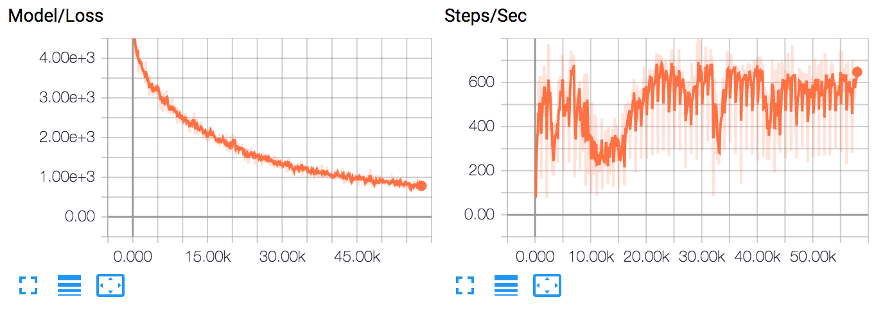

# TensorFlow Scala

[](https://circleci.com/gh/eaplatanios/tensorflow_scala/tree/master)
[](https://www.codacy.com/app/eaplatanios/tensorflow_scala?utm_source=github.com&amp;utm_medium=referral&amp;utm_content=eaplatanios/tensorflow_scala&amp;utm_campaign=Badge_Grade)

[](http://platanios.org/tensorflow_scala/api/api)
[](http://platanios.org/tensorflow_scala/api/jni)
[](http://platanios.org/tensorflow_scala/api/data)
[](http://platanios.org/tensorflow_scala/api/examples)

This library is a Scala API for [https://www.tensorflow.org](https://www.tensorflow.org). It attempts to provide most of
the functionality provided by the official Python API, while at the same type being strongly-typed and adding some new
features. It is a work in progress and a project I started working on for my personal research purposes. Much of the API
should be relatively stable by now, but things are still likely to change.

[](https://gitter.im/eaplatanios/tensorflow_scala?utm_source=badge&utm_medium=badge&utm_campaign=pr-badge&utm_content=badge)

@@@index

* [Installation](installation.md)
* [Guides](guides.md)
* [Contributing](contributing.md)
* [Release Notes](release_notes.md)

@@@

## Citation

It would be greatly appreciated if you could cite this project using the following BibTex entry, if you end up using it
in your work:

```bibtex
@misc{Platanios:2018:tensorflow-scala,
  title        = {{TensorFlow Scala}},
  author       = {Platanios, Emmanouil Antonios},
  howpublished = {\url{https://github.com/eaplatanios/tensorflow_scala}},
  year         = {2018}
}
```

## Main Features

  - Easy manipulation of tensors and computations involving tensors (similar to NumPy in Python):

    @@snip [Index.scala](/docs/src/main/scala/Index.scala) { #tensors_example }

  - Low-level graph construction API, similar to that of the Python API, but strongly typed wherever possible:

    @@snip [Index.scala](/docs/src/main/scala/Index.scala) { #low_level_example }

  - Numpy-like indexing/slicing for tensors. For example:

    @@snip [Index.scala](/docs/src/main/scala/Index.scala) { #slice_example }

  - High-level API for creating, training, and using neural networks. For example, the following code shows how simple it
    is to train a multi-layer perceptron for MNIST using TensorFlow for Scala. Here we omit a lot of very powerful
    features such as summary and checkpoint savers, for simplicity, but these are also very simple to use.

    @@snip [Index.scala](/docs/src/main/scala/Index.scala) { #mnist_example }

    And by changing a few lines to the following code, you can get checkpoint capability, summaries, and seamless
    integration with TensorBoard:

    @@snip [Index.scala](/docs/src/main/scala/Index.scala) { #tensorboard_example }

    If you now browse to `https://127.0.0.1:6006` while training, you can see the training progress:

    

  - Efficient interaction with the native library that avoids unnecessary copying of data. All tensors are created and
    managed by the native TensorFlow library. When they are passed to the Scala API (e.g., fetched from a TensorFlow
    session), we use a combination of weak references and a disposing thread running in the background. Please refer to
    `tensorflow/src/main/scala/org/platanios/tensorflow/api/utilities/Disposer.scala`, for the implementation.

## Tutorials

- [Object Detection using Pre-Trained Models](https://brunk.io/deep-learning-in-scala-part-3-object-detection.html)
- [Linear Regression via ANN](https://novakov-alexey.github.io/tensorflow-scala/)

## Funding

Funding for the development of this library has been generously provided by the following sponsors:

| **CMU Presidential Fellowship**         | **National Science Foundation**   | **Air Force Office of Scientific Research**     |
|:---------------------------------------:|:---------------------------------:|:-----------------------------------------------:|
| awarded to Emmanouil Antonios Platanios | Grant #: IIS1250956               | Grant #: FA95501710218                          |
||||

TensorFlow, the TensorFlow logo, and any related marks are trademarks of Google Inc.
